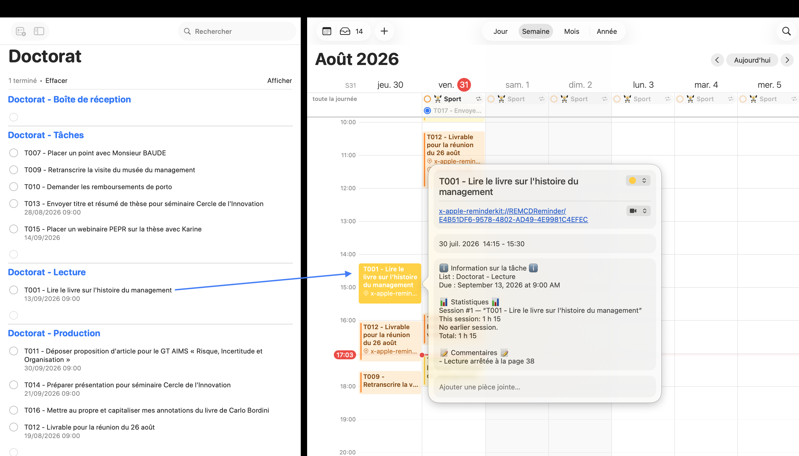

# Reminders → Calendar Bridge

**Réservez du temps pour une tâche dans Calendrier — et gardez la tâche avec.**



Déposer un rappel sur votre calendrier vous donne un créneau, et rien d'autre.
L'événement est une copie morte : renommez la tâche, il garde l'ancien titre ;
travaillez-y trois séances, rien ne vous dit combien de temps cela vous a pris ;
déposez-le alors qu'un autre calendrier était sélectionné, il y reste.

Cette application maintient les deux vivants ensemble, en temps réel, sur votre
Mac.

- **Chaque séance porte sa tâche.** Liste, échéance, priorité, commentaires —
  relevés sur le rappel lui-même et rafraîchis dès qu'il change, titre de
  l'événement compris.
- **Le temps s'additionne.** *Session n°8 — cette session : 2 h 30 — cumul :
  16 h 45.* Redimensionnez un créneau, et toutes les séances suivantes se
  recomptent.
- **Vos notes sont à l'abri.** Une section protégée n'est jamais réécrite, pas
  même par un retraitement complet. C'est là qu'écrire ce que vous avez
  réellement accompli.
- **Un clic pour revenir à la tâche**, et des liens pour la cocher sans quitter
  Calendrier. Une tâche terminée marque toutes ses séances passées.
- **Les événements se rangent seuls.** Déposé dans le mauvais calendrier, un
  événement rejoint celui associé à la liste de sa tâche.
- **Aucune scrutation périodique.** L'application dort jusqu'à ce que macOS
  signale un changement dans Calendrier ou Rappels — y compris quand un
  événement créé sur iPhone achève de se synchroniser sur le Mac.
- **Rien ne sort de votre Mac**, hormis une vérification de mise à jour
  quotidienne.

Plusieurs listes de rappels peuvent alimenter le même calendrier, ou disposer
chacune du sien : tâches, lecture, rédaction, quelle que soit l'ontologie que
vous vous donnerez.

*This README is also available in English: [README.md](README.md).*

> L'identifiant de bundle reste `fr.equiriconi.SessionsStats`, nom que portait
> l'application à ses débuts : il est ce à quoi macOS rattache les autorisations
> Calendrier et Rappels, les réglages et l'état des événements déjà traités. Le
> changer les remettrait tous à zéro.

## Installation

```
./build.sh
```

Puis déplacez `RemindersCalendarBridge.app` dans `/Applications` et **lancez-la depuis le
Finder** (double-clic). Une fois cette première installation faite, `build.sh`
reporte automatiquement les versions suivantes dans `/Applications`. Ce point n'est pas cosmétique : lancée par un autre
programme, l'application hérite des autorisations de celui-ci au lieu de
demander les siennes, et macOS refuse l'accès au Calendrier sans afficher de
dialogue.

Deux demandes d'autorisation apparaissent au premier lancement (Calendrier,
puis Rappels). Acceptez-les.

Aucune icône dans le Dock : l'application vit dans la barre de menus.

## Réglages

Menu de la barre de menus → **Réglages…**

**Général**
- Surveillance active / lancement à l'ouverture de session
- Fenêtre de détection (±N jours) et profondeur d'historique (N années),
  communes à toutes les associations
- État des autorisations, nombre d'événements suivis, dernière activité
- **Analyser maintenant**, **Oublier l'état**, **Retraiter tout l'historique**

**Associations** — voir ci-dessous.

**Journal** — les 200 dernières lignes, et accès au fichier complet.

## Associations

Une association relie **une ou plusieurs listes de rappels à un calendrier**. Il
peut y avoir autant d'associations que voulu, et chacune a sa propre mise en
forme :

```
Doctorat - Tâches, Doctorat - Rédaction  →  Sessions de travail
Doctorat - Lecture                       →  Sessions de lecture
```

Quand plusieurs listes alimentent le même calendrier, chaque tâche garde son
identité : sa liste d'appartenance figure en première ligne de la section
« Informations de la tâche ». Un coup d'œil à l'événement suffit donc à savoir
d'où vient la tâche.

Un même calendrier peut apparaître dans plusieurs associations. Ne cocher aucune
liste traite tous les événements du calendrier et les regroupe sur leur propre
titre, sans passer par Rappels.

Chaque association définit :

- la tolérance à un suffixe après le titre de la tâche ;
- **les sections de la description, leur ordre et leurs libellés** — l'ordre se
  change en glissant les lignes ;
- le texte initial de la section personnelle ;
- le contenu du bloc de statistiques, ligne par ligne ;

avec un aperçu en direct du résultat.

## Rangement d'après la liste

Calendrier retient le dernier calendrier utilisé : un rappel déposé à la suite
d'un autre atterrit souvent au mauvais endroit. L'application corrige ce
travers — dès qu'un événement est rattaché à sa tâche, il est déplacé vers le
calendrier associé à la liste dont vient cette tâche.

Les calendriers associés à rien sont balayés eux aussi — le dernier calendrier
utilisé peut très bien en être un. Déposé là, un rappel ne laisse **aucun lien
vers sa tâche** : Calendrier n'en inscrit un que dans les calendriers qu'il
connaît. Le titre est donc le seul indice disponible, et il est accepté sous
deux conditions strictes : le titre de la tâche doit compter au moins six
caractères, et ne désigner qu'une seule tâche. Deux tâches homonymes ne se
départagent pas — rien n'est déplacé, et le journal le dit.

Trois garde-fous :

- une liste rattachée à plusieurs calendriers n'a pas de destination évidente :
  rien n'est déplacé, et l'ambiguïté est signalée dans le journal ;
- une association sans liste cochée est un fourre-tout et garde ses événements ;
- les calendriers en lecture seule (anniversaires, jours fériés) ne sont pas
  touchés.

Le réglage figure dans l'onglet Général et peut être désactivé.

## Fonctionnement

1. À chaque notification (regroupée sur 2 s pour absorber les rafales iCloud),
   les événements de chaque association sont listés sur la fenêtre de détection.
2. Ils sont comparés à `~/Library/Application Support/RemindersCalendarBridge/state.json`,
   qui retient les identifiants déjà traités. La détection ne repose donc pas
   sur la date de création : un événement est « nouveau » au moment où il
   apparaît sur le Mac, quel qu'ait été le délai de synchronisation.
3. Pour chaque nouvel événement de titre X, un rappel de titre X doit exister
   dans la liste associée (terminé ou non) ; sinon l'événement est ignoré.
4. Les événements de même titre qui se terminent avant le début de la session
   courante sont comptés, leurs durées sommées, et les sections sont écrites.

Le rapprochement des titres est insensible à la casse, aux accents et aux
espaces superflus.

## Glisser-déposer depuis Rappels

Déposer un rappel sur le calendrier crée un événement dont le titre reprend
celui de la tâche **suivi du contenu de sa note**. L'application gère ce cas :

- la correspondance se fait par préfixe, donc l'événement est bien rattaché à sa
  tâche malgré le suffixe (« Tolérer un suffixe après le titre de la tâche ») ;
- le regroupement se fait sur le titre de la **tâche**, sans quoi une même
  activité serait comptée séparément selon que le suffixe est présent ou non ;
- le titre de l'événement est ramené à celui de la tâche, tel qu'il figure dans
  Rappels ;
- le contenu de la note n'est pas récupéré depuis le titre : il est reconstitué
  proprement depuis les propriétés du rappel, dans la section « Informations de
  la tâche » décrite ci-dessous.

**Premier lancement** : les événements déjà présents sont enregistrés comme vus
sans être modifiés — l'historique n'est pas réécrit rétroactivement. Le bouton
« Retraiter tout l'historique » permet de forcer l'inverse.

## Description de l'événement

Elle est composée de trois sections balisées :

```
── Informations de la tâche ──
Liste : Doctorat - Tâches
Échéance : 14 septembre 2026
Priorité : haute
Commentaires : voir le compte rendu du 3 juillet

── Notes personnelles ──
Relu les entretiens 4 à 7, plan de la section 2 arrêté.

── Statistiques ──
Session n°8 — « Rédaction chapitre 2 »
Cette session : 2 h 30
Sessions antérieures : 7 — 14 h 15
Dernière séance : 22 juillet 2026
Cumul : 16 h 45
```

**Informations de la tâche** — relevées sur le rappel lui-même : liste,
échéance, date de début, priorité, lieu, lien, récurrence, alertes, date
d'achèvement, commentaires. Seules les propriétés renseignées apparaissent.
Régénérée à chaque passage.

**Notes personnelles** — section protégée. Son contenu est repris mot pour mot,
y compris lors d'un retraitement complet : c'est là qu'écrire ce que vous avez
accompli. Le texte libre trouvé dans une description antérieure à toute section
y est versé au premier passage, plutôt que d'être écrasé.

**Statistiques** — régénérée à chaque passage.

L'ordre des trois sections se règle par glissement, association par association,
et chaque section peut être désactivée. Les lignes de séparation sont
personnalisables : les modifier après coup empêche de retrouver les sections
déjà écrites dans les événements existants.

## Suivi des tâches modifiées

Chaque événement écrit porte un lien vers son rappel dans le champ **Lieu ou
appel vidéo** :

```
x-apple-reminderkit://REMCDReminder/5C1F…A93
```

Calendrier l'affiche comme un lien cliquable : la tâche s'ouvre dans Rappels
d'un clic, et le même champ fait office d'identifiant durable.

C'est ce lien qui rend le suivi possible. Si vous renommez un rappel, ou en
changez l'échéance, la priorité ou les commentaires, tous les événements qui en
dépendent sont mis à jour au prochain passage — titre compris. Une comparaison
de titres ne le permettrait pas : après renommage, plus rien ne correspondrait.

Redimensionner un créneau met aussi les statistiques à jour — sa propre durée
et le cumul de toutes les séances suivantes de la même tâche. Les horaires de
l'ensemble des séances entrent dans l'empreinte de l'événement, ce qui déclenche
la réécriture.

Les statistiques ne sont jamais perdues dans l'opération : elles ne sont pas
stockées, elles sont recalculées depuis le calendrier à chaque écriture. Les
notes personnelles, elles, sont reprises mot pour mot.

Un lieu saisi à la main n'est jamais écrasé : le champ n'est rempli que s'il est
vide ou s'il contient déjà un lien de rappel.

Le rattachement se fait dans cet ordre : lien dans le lieu, identifiant en fin
de note (facultatif, désactivé par défaut, utile si vous réservez le champ
« Lieu » à un véritable lieu), fichier d'état local, puis comparaison de titres.

**Tâche terminée** — dès qu'un rappel est coché, le titre de ses événements est
précédé d'un marqueur (`✅` par défaut, modifiable ou supprimable par
association). Décocher la tâche le retire.

## Liens d'action

La dernière section de la description propose des liens qui agissent sur la
tâche :

```
── Actions ──
Marquer terminée  rcb://complete/5C1FA93B
Ouvrir la tâche  rcb://open/5C1FA93B
```

Le champ Notes d'un événement est du **texte brut** : `EKEvent.notes` est une
simple chaîne, sans API de texte enrichi. Calendrier y détecte les URL lui-même,
un lien ne peut donc pas se cacher derrière un libellé. Les URL sont par
conséquent réduites au minimum : les huit premiers caractères de l'UUID de la
tâche suffisent à la désigner parmi les rappels des listes associées, et un
jeton ambigu est refusé plutôt que deviné.

`rcb://` est un schéma déclaré par l'application. Le clic la réveille, elle agit
sur le rappel via EventKit, puis réécrit les événements qui en dépendent — le
marqueur d'achèvement et les liens eux-mêmes basculent en conséquence. Rien ne
sort de la machine, aucun serveur n'intervient.

Modifier un réglage de mise en forme — ou installer une version qui écrit
différemment — suffit à faire réécrire les événements au passage suivant : les
réglages de mise en forme et la version de l'application entrent dans
l'empreinte de chaque événement. Sans cela, l'aperçu des réglages et le
calendrier divergeraient jusqu'à ce que la tâche elle-même change.

Seule l'action pertinente est proposée : « Marquer terminée » sur une tâche
ouverte, « Rouvrir la tâche » sur une tâche cochée.

Comme les autres, la section Actions se réordonne ou se désactive par
association.

## Langue

Français et anglais, au choix dans l'onglet Général, ou selon la langue du
système. Le réglage porte aussi bien sur l'interface que sur le texte écrit dans
les descriptions d'événements.

## Mises à jour

L'application interroge les publications GitHub de ce dépôt, au plus une fois
par jour, et signale l'existence d'une version plus récente. Rien n'est installé
sans votre accord.

L'application étant signée en ad-hoc, il n'y a pas de certificat de développeur
à vérifier. Le lien de confiance repose donc sur trois points : le dépôt est
figé dans le code, l'échange se fait en HTTPS, et l'archive téléchargée doit
présenter une signature intacte et le même identifiant de bundle que
l'application en place. L'ancienne version est conservée le temps du
remplacement et remise en place en cas d'échec.

Pour publier une version : porter le nouveau numéro dans `CFBundleShortVersionString`
(Info.plist), construire, puis

```
ditto -c -k --sequesterRsrc --keepParent /Applications/RemindersCalendarBridge.app RemindersCalendarBridge.zip
gh release create vX.Y.Z RemindersCalendarBridge.zip --title vX.Y.Z --notes "…"
```

## Signature et autorisations

`build.sh` signe l'application en ad-hoc, ce qui suffit à TCC et à l'ouverture
au démarrage. Chaque recompilation change l'empreinte du binaire : macOS peut
alors redemander les autorisations.

**Point critique** : la signature active le *hardened runtime*, et dans ce mode
macOS exige des droits explicites pour accéder au Calendrier et aux Rappels.
Ils sont déclarés dans `RemindersCalendarBridge.entitlements` :

- `com.apple.security.personal-information.calendars`
- `com.apple.security.personal-information.reminders`

Sans eux, l'accès est refusé **immédiatement et silencieusement** : aucun
dialogue d'autorisation ne s'affiche, l'application n'apparaît nulle part dans
Réglages Système → Confidentialité, et rien dans son propre journal n'en donne
la raison. Le diagnostic se lit uniquement dans les traces de `tccd` :

```
/usr/bin/log stream --predicate 'process == "tccd"' --info --debug
```

Ne retirez pas l'option `--entitlements` de `build.sh`.

## Licence

MIT — voir [LICENSE](LICENSE).
